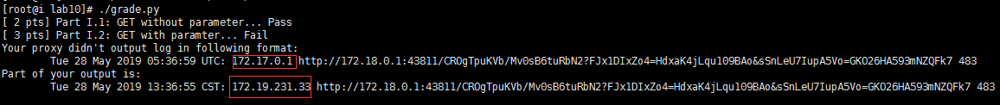

****************
ICS Proxy Lab
****************

Makefile	- For building and handing in proxy
README		- This file

# Proxy source files
proxy.{c,h}	- Primary proxy code
csapp.{c,h}	- Wrapper and helper functions from the CS:APP text

## Document

The homework document can be found [here](./assets/lab10.pdf)

## Review

Here is some interesting(fucking) bugs I met

* `int a, b =0;` Then `a` is uninitialized

* It will cause bug if I connect to the server before I read from a wrong client head with a wrong server_path or a wrong method

  That means if your code is as below, given a request like 

  `GET http://www.baidu.com:80/wrong_path HTTP/1.1` or 

  `GET http://www.baidu.com:80/hello wrong_method`  will cause bug

  ~~~c
  parse_uri(uri, server_hostname, server_pathname, server_port);
  
  sprintf(buf_request_content, "%s %s %s\r\n", method, server_pathname, version);
  
  proxy_clientfd = open_clientfd(server_hostname, server_port);
  
  read_head_from_client();
  ~~~

* When reading big file from server, the big file maybe cut to many small pieces. And each small piece doesn't have a EOF, which make it impossible for you to recognize whether the piece has been read all if you use `rio_readnb()`, and the consequence of it is that it will be blocked and causes timeout. The solution to it is to use `rio_read()`, which try to read n bytes, but return 0 if there are no more bytes to read.

* Running the grade.py on aliyun EMS may cause bug like this:

  